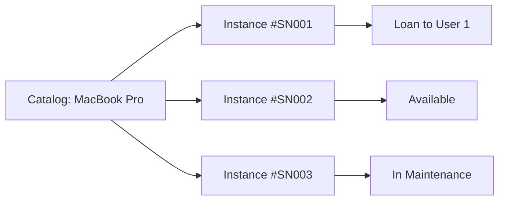

## Overview

The SWL Inventory Management system uses a two-tier architecture: **Catalog** (generic items) and **ItemInstance** (physical units). This design allows tracking individual serial numbers, managing item-specific statuses, and handling concurrent loan requests efficiently.

## Architecture

### Two-Tier Model

<CardGroup cols={2}>
  <Card title="Catalog" icon="book">
    Generic item definition (e.g., "Dell Latitude 5420")
    - Title/Name
    - Category
    - Author/Brand
  </Card>
  <Card title="ItemInstance" icon="barcode">
    Physical unit with unique identifier
    - Serial Number
    - Status (available, loaned, etc.)
    - Condition
  </Card>
</CardGroup>



## Data Models

### Catalog Model

Represents a generic item type:

```python app/models.py
class Catalog(db.Model):
    id = db.Column(db.Integer, primary_key=True)
    title_or_name = db.Column(db.String(150), nullable=False) 
    category = db.Column(db.String(50), nullable=False) 
    author_or_brand = db.Column(db.String(100), nullable=True) 
    
    instances = db.relationship('ItemInstance', backref='catalog_item', 
                               lazy='dynamic', cascade="all, delete-orphan")
```

### ItemInstance Model

Represents a physical item:

```python app/models.py
class ItemInstance(db.Model):
    id = db.Column(db.Integer, primary_key=True)
    catalog_id = db.Column(db.Integer, db.ForeignKey('catalog.id'), nullable=False)
    unique_code = db.Column(db.String(50), unique=True, nullable=False) 
    status = db.Column(db.String(20), default='disponible')
    condition = db.Column(db.String(100), nullable=True) 
    
    loans = db.relationship('Loan', backref='item_instance', lazy='dynamic')
```

## Categories

The system supports multiple categories for organizing inventory:

| Category | Description | Examples | Penalty on Overdue |
|----------|-------------|----------|-------------------|
| `computo` | Computing equipment | Laptops, monitors, tablets | No |
| `accesorio` | Accessories and general items | Cables, mice, chargers | No |
| `libro` | Books and reading material | Textbooks, novels, periodicals | Yes (fee per day) |

<Note>
  **Category Configuration**: When creating new catalog items via the admin interface (`/admin/catalog`), you can choose from three categories: **Equipo de Cómputo** (`computo`), **Accesorio / General** (`accesorio`), or **Libro** (`libro`) as defined in `CatalogForm`. 
  
  The seed data in `run.py` also uses legacy categories `general` and `premium` for backward compatibility with existing data.
</Note>

<Info>
  **Access Control**: Premium users can access specialized equipment. Cliente (regular) users have access to computing and general accessories but may be restricted from certain premium items based on role-based filtering in the routes.
</Info>

## Item Statuses

### Available Statuses

<AccordionGroup>
  <Accordion title="disponible" icon="circle-check" defaultOpen>
    Item is available for loan. Can be reserved by users.
  </Accordion>
  
  <Accordion title="prestado" icon="hand-holding">
    Item is currently on loan to a user. Cannot be requested until returned.
  </Accordion>
  
  <Accordion title="mantenimiento" icon="wrench">
    Item is under maintenance or repair. Not available for loans.
  </Accordion>
  
  <Accordion title="perdido" icon="triangle-exclamation">
    Item is lost or missing. Permanently unavailable.
  </Accordion>
</AccordionGroup>

## Catalog Management

### Creating Catalog Items

Librarians and admins can create new catalog entries:

```python app/admin/routes.py
@bp.route('/catalog', methods=['GET', 'POST'])
@role_required('bibliotecario', 'admin')
def catalog_manage():
    form = CatalogForm()
    if form.validate_on_submit():
        new_catalog_item = Catalog(
            title_or_name=form.title_or_name.data,
            category=form.category.data,
            author_or_brand=form.author_or_brand.data
        )
        db.session.add(new_catalog_item)
        db.session.commit()
        flash(f'Elemento de catálogo "{form.title_or_name.data}" creado.', 'success')
        return redirect(url_for('admin.catalog_manage'))
```

### Searching Catalog

Search by title or category:

```python app/admin/routes.py
search_query = request.args.get('search', '')
query = Catalog.query
if search_query:
    query = query.filter(
        or_(
            Catalog.title_or_name.ilike(f'%{search_query}%'),
            Catalog.category.ilike(f'%{search_query}%')
        )
    )

items = query.order_by(Catalog.title_or_name).all()
```

### Deleting Catalog Items

<Warning>
  Catalog items with existing instances cannot be deleted due to referential integrity.
</Warning>

```python app/admin/routes.py
@bp.route('/catalog/delete/<int:id>', methods=['POST'])
@role_required('bibliotecario', 'admin')
def catalog_delete(id):
    item = Catalog.query.get_or_404(id)
    if item.total_count > 0:
        flash('No puedes eliminar un catálogo que tiene instancias físicas.', 'danger')
    else:
        db.session.delete(item)
        db.session.commit()
        flash('Elemento de catálogo eliminado.', 'success')
```

## Instance Management

### Adding Physical Instances

Add serial-numbered instances to catalog items:

```python app/admin/routes.py
@bp.route('/catalog/<int:catalog_id>/instances', methods=['GET', 'POST'])
@role_required('bibliotecario', 'admin')
def manage_instances(catalog_id):
    catalog_item = Catalog.query.get_or_404(catalog_id)
    form = InstanceForm()

    if form.validate_on_submit():
        unique_code = form.unique_code.data.strip()
        
        # Check for duplicate serial number
        if ItemInstance.query.filter_by(unique_code=unique_code).first():
            flash(f'El código/serial "{unique_code}" ya está registrado.', 'danger')
        else:
            new_instance = ItemInstance(
                catalog_id=catalog_id,
                unique_code=unique_code,
                condition=form.condition.data,
                status=form.status.data,
            )
            db.session.add(new_instance)
            db.session.commit()
            flash(f'Instancia "{unique_code}" agregada.', 'success')
```

### Updating Instance Status

Librarians can change instance status for maintenance or lost items:

```python app/admin/routes.py
@bp.route('/instance/update_status/<int:instance_id>', methods=['POST'])
@role_required('bibliotecario', 'admin')
def update_instance_status(instance_id):
    instance = ItemInstance.query.get_or_404(instance_id)
    form = UpdateInstanceStatusForm()

    if form.validate_on_submit():
        new_status = form.status.data

        if new_status in ['disponible', 'mantenimiento', 'perdido']:
            instance.status = new_status
            db.session.commit()
            flash(f'Estado de la instancia {instance.unique_code} '
                  f'actualizado a {new_status}.', 'success')
        else:
            flash('Estado no válido.', 'danger')
```

<Note>
  **Protected Statuses**: The `prestado` status is automatically managed by the loan system and cannot be manually set.
</Note>

### Deleting Instances

Instances with active loans cannot be deleted:

```python app/admin/routes.py
@bp.route('/instance/delete/<int:instance_id>', methods=['POST'])
@role_required('bibliotecario', 'admin')
def instance_delete(instance_id):
    instance = ItemInstance.query.get_or_404(instance_id)
    
    # Check for active loans
    if instance.loans.filter(Loan.status.in_(['pendiente', 'activo', 'atrasado'])).first():
        flash('No puedes eliminar una instancia con préstamo activo.', 'danger')
    else:
        db.session.delete(instance)
        db.session.commit()
        flash(f'Instancia {instance.unique_code} eliminada.', 'success')
```

## Inventory Service Layer

### Reserving Instances

The InventoryService handles atomic reservations with row-level locking:

```python app/services/inventory_service.py
class InventoryService:
    @staticmethod
    def reserve_instances(catalog_id, quantity):
        try:
            catalog = Catalog.query.get(int(catalog_id))
            if not catalog:
                return False, [], "Catálogo no encontrado."
                
            # Row-level locking with skip_locked
            available_instances = catalog.instances.filter_by(status='disponible')\
                .limit(quantity).with_for_update(skip_locked=True).all()
            
            if len(available_instances) < quantity:
                return False, [], "Stock físico insuficiente o bloqueado."
                
            reserved_ids = []
            for instance in available_instances:
                instance.status = 'prestado' 
                reserved_ids.append(instance.id)
                
            return True, reserved_ids, "Instancias reservadas exitosamente."
            
        except sqlalchemy.exc.OperationalError as e:
            db.session.rollback()
            return False, [], "Sistema procesando otra solicitud. Intente nuevamente."
```

<Tip>
  **Race Condition Prevention**: `with_for_update(skip_locked=True)` prevents deadlocks when multiple users request the same item simultaneously.
</Tip>

### Releasing Instances

Return an instance to available inventory:

```python app/services/inventory_service.py
@staticmethod
def release_instance(instance_id):
    instance = ItemInstance.query.get(instance_id)
    if not instance:
        return False, "Instancia física no encontrada."
        
    instance.status = 'disponible'
    return True, "Instancia liberada y devuelta al inventario."
```

## Catalog Service Layer

### N+1 Query Prevention

The CatalogService provides optimized queries with availability counts:

```python app/services/inventory_service.py
class CatalogService:
    @staticmethod
    def get_catalog_with_counts(category_filter=None, exclude_category=None):
        """Return catalog items with available count injected dynamically"""
        query = db.session.query(
            Catalog, 
            func.count(ItemInstance.id).label('avail_count')
        ).outerjoin(
            ItemInstance, 
            (ItemInstance.catalog_id == Catalog.id) & 
            (ItemInstance.status == 'disponible')
        ).group_by(Catalog.id)

        if category_filter:
            query = query.filter(Catalog.category == category_filter)
        if exclude_category:
            query = query.filter(Catalog.category != exclude_category)

        results = query.all()
        items = []
        for catalog_obj, count in results:
            # Dynamically inject available_count
            catalog_obj.available_count = count 
            items.append(catalog_obj)
        return items
```

<Info>
  **Performance Optimization**: This single query replaces potentially hundreds of individual queries when displaying catalog lists.
</Info>

### Paginated Catalog

For large inventories, use pagination:

```python app/services/inventory_service.py
@staticmethod
def get_paginated_catalog(page, per_page=12, category_filter=None, exclude_category=None):
    query = db.session.query(
        Catalog, 
        func.count(ItemInstance.id).label('avail_count')
    ).outerjoin(
        ItemInstance, 
        (ItemInstance.catalog_id == Catalog.id) & 
        (ItemInstance.status == 'disponible')
    ).group_by(Catalog.id)

    if category_filter:
        query = query.filter(Catalog.category == category_filter)
    if exclude_category:
        query = query.filter(Catalog.category != exclude_category)

    pagination = query.paginate(page=page, per_page=per_page, error_out=False)
    items = []
    for catalog_obj, count in pagination.items:
        catalog_obj.available_count = count
        items.append(catalog_obj)
    pagination.items = items
    return pagination
```

## Usage Examples

### Displaying Available Items

```python
# In route handler
available_computers = CatalogService.get_catalog_with_counts(category_filter='computo')

# In template

  <option value="{{ item.id }}">
    {{ item.title_or_name }} ({{ item.available_count }} disponibles)
  </option>

```

### Excluding Categories for Specific Roles

```python
# Cliente users cannot see premium items
exclude_cat = 'premium' if current_user.role == 'cliente' else None
available_items = CatalogService.get_catalog_with_counts(exclude_category=exclude_cat)
```

### Atomic Multi-Instance Reservation

```python
# Reserve 3 USB drives
success, reserved_ids, msg = InventoryService.reserve_instances(catalog_id=5, quantity=3)

if success:
    # Create loans for each reserved instance
    for inst_id in reserved_ids:
        LoanService.create_loan(user_id=user.id, instance_id=inst_id)
    db.session.commit()
else:
    flash(msg, 'danger')
```

## Workflows

### Adding New Equipment

<Steps>
  <Step title="Create Catalog Entry">
    Navigate to `/admin/catalog` and add the generic item (e.g., "MacBook Pro 16"")
  </Step>
  <Step title="Add Physical Instances">
    Click on the catalog item and add instances with unique serial numbers
  </Step>
  <Step title="Set Condition">
    Specify condition notes (e.g., "New", "Minor scratches")
  </Step>
  <Step title="Verify Availability">
    Check that instances show `disponible` status and appear in user catalogs
  </Step>
</Steps>

### Marking Item as Lost

<Steps>
  <Step title="Locate Instance">
    Find the specific instance by serial number in `/admin/catalog/{id}/instances`
  </Step>
  <Step title="Update Status">
    Change status to `perdido` using the status update form
  </Step>
  <Step title="Document">
    Add notes to the condition field explaining circumstances
  </Step>
  <Step title="Remove from Circulation">
    Instance will no longer appear in available counts
  </Step>
</Steps>

## Best Practices

<CardGroup cols={2}>
  <Card title="Unique Serial Numbers" icon="fingerprint">
    Always use manufacturer serial numbers or create consistent internal codes (e.g., COMP-001, BOOK-042)
  </Card>
  <Card title="Regular Audits" icon="clipboard-list">
    Periodically verify physical inventory matches database records
  </Card>
  <Card title="Condition Tracking" icon="notes">
    Document item condition at check-in/check-out to track wear and damage
  </Card>
  <Card title="Status Consistency" icon="sync">
    Ensure instance status matches physical reality (don't mark as available if damaged)
  </Card>
</CardGroup>

## Related Features

- [Loan System](/features/loan-system) - How inventory integrates with borrowing workflow
- [Fast Loan Kiosk](/features/fast-loan-kiosk) - Quick inventory lookup for kiosk mode
- [User Management](/features/user-management) - Role-based access to different categories